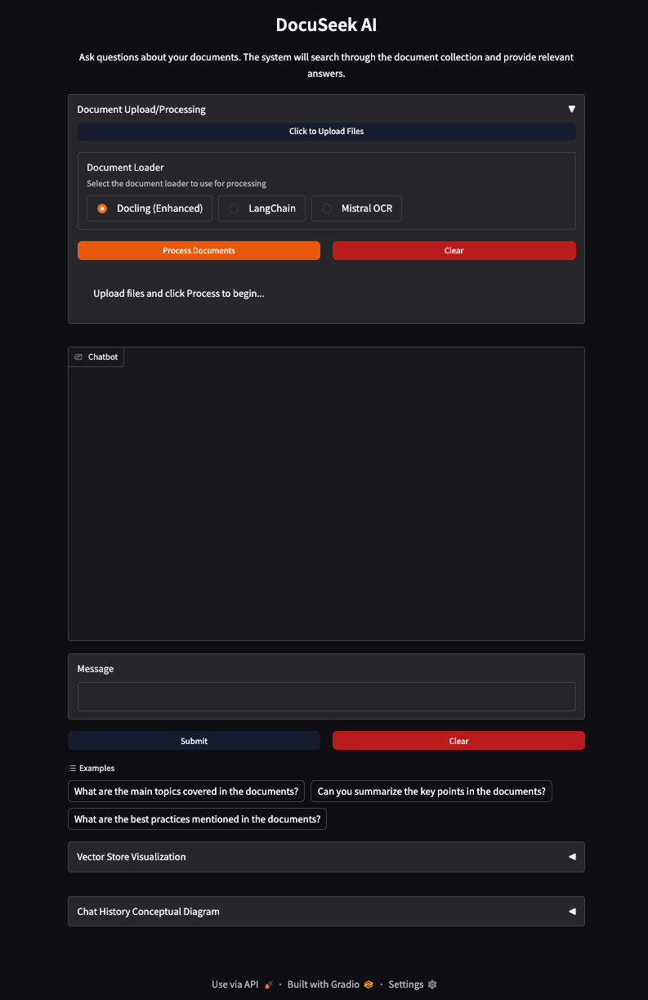

# DocuSeek AI

**DocuSeek AI: Unlock Insights from Your Private Documents**

Securely chat with your private documents using an intelligent RAG system. DocuSeek AI leverages powerful LLMs and vector search to provide accurate, context-aware answers based *only* on your uploaded content, ensuring privacy and relevance. Process various formats, visualize data relationships, and gain deeper understanding effortlessly.



## Project Overview

DocuSeek AI provides a complete RAG (Retrieval-Augmented Generation) system for processing, indexing, and querying private documents. It leverages vector embeddings and integrates with LLMs to deliver contextual responses based on your document corpus.

## Quick Start

### Prerequisites

- Python 3.8+
- Docker & Docker Compose (Recommended)
- `docker buildx` plugin enabled (usually included with recent Docker Desktop versions)
- OpenAI API Key
- (Optional) Mistral API Key (for OCR)

See [Dependencies](docs/dependencies.md) for full details.

### Using Docker (Recommended)

This setup uses a simple script to build the image and start all services.

1.  **Configure Environment**: Create a file named `.env.docker` in the project root. Copy the contents from the example in [Environment Configuration](docs/environment_configuration.md) and populate it with your API keys and desired settings (e.g., database password).

2.  **Run the Startup Script**: Make the script executable (if you haven't already) and run it:
    ```bash
    chmod +x start_docker.sh
    ./start_docker.sh
    ```
    This script will automatically:
    *   Build the application image using `docker buildx bake`.
    *   Start the application (Chat UI by default), PostgreSQL, and pgAdmin using `docker compose`.

3.  **Access Services (Chat UI runs by default)**:
    *   **Chat Interface**: `http://localhost:7861`
    *   **pgAdmin**: `http://localhost:8080` (Login with details from `.env.docker`)
    *   *Note: The API server (port 8000) is not started by default. See instructions below or the [Docker Command Reference](docs/docker_commands.md) to start it.*

4.  **Process Your Documents**: Once the services are running, place your documents in the `documents/` directory and run the processing command:
    ```bash
    docker compose exec app python main.py process --dir documents
    ```
    *(Note: The first time you run this after resetting the database, it will automatically create the necessary database tables.)*

5.  **Use the Chat or Start API Server**:
    *   Interact with your documents via the Chat Interface at `http://localhost:7861`.
    *   **Optional: Start the API Server.** If you need the API endpoints, run this command in a separate terminal:
        ```bash
        docker compose exec app python main.py api
        ```
        Then access the API at `http://localhost:8000` (Docs: `http://localhost:8000/docs`).

*Troubleshooting: If `docker compose up` (run by the script) warns about missing API keys despite them being in `.env.docker`, check if those variables are set in your shell (`echo $VAR_NAME`). Shell variables take precedence; `unset VAR_NAME` before running the script if needed.* 

See the full [Docker Command Reference](docs/docker_commands.md) for manual commands and other operations.

### Manual Setup

*(Note: Docker is strongly recommended for managing dependencies like PostgreSQL)*

1.  **Install Dependencies**: `pip install -r requirements.txt`
2.  **Setup Database**: Manually set up PostgreSQL with the pgvector extension.
3.  **Configure Environment**: Create a `.env` file. See [Environment Configuration](docs/environment_configuration.md). Ensure database connection details match your manual setup.
4.  **Create Database Tables**: Manually run database schema creation logic (e.g., using Alembic if integrated, or a custom script calling `Base.metadata.create_all`).
5.  **Available Commands**:
    ```bash
    # Process documents (replace 'documents' with your directory)
    python main.py process --dir documents

    # Start chat interface (Default: http://127.0.0.1:7860)
    python main.py chat

    # Run vector similarity search (interactive)
    python main.py search

    # Start the API server (Default: http://0.0.0.0:8000)
    python main.py api
    ```
    For more command options, run `python main.py --help`.

## Key Features

- Document Processing (PDF, DOCX, TXT, etc.)
- Vector Storage & Similarity Search (PostgreSQL/pgvector)
- Interactive Chat Interface (Gradio)
- FastAPI Backend & API Endpoints
- Optional Enhanced Conversion (Docling) & OCR (Mistral)
- Caching (File-based/Redis)
- Duplicate Document Detection (Checksums)
- Asynchronous Processing Pipeline
- Vector Visualization
- Conceptual Diagram Generation from Chat

For a full list, see [Features](docs/features.md).

## Documentation

- **Architecture & Flow Diagrams:**
    - [High-Level Architecture Overview](docs/architecture_overview.md)
    - [Docker Deployment View](docs/docker_deployment.md)
    - [Chat Interaction Flow](docs/chat_flow.md)
    - [Document Processing Flow](docs/document_processing_flow.md)
- **Core Documentation:**
    - [Project Structure](docs/project_structure.md)
    - [Docker Command Reference](docs/docker_commands.md)
    - [API Reference](docs/api_reference.md)
    - [Features](docs/features.md)
    - [Conceptual Diagrams Feature](docs/conceptual_diagrams.md)
    - [Environment Configuration](docs/environment_configuration.md)
    - [Dependencies](docs/dependencies.md)
    - [Advanced Features](docs/advanced_features.md)
- **Integrations:**
    - [Docling Integration](docs/docling_integration.md) (If available)
