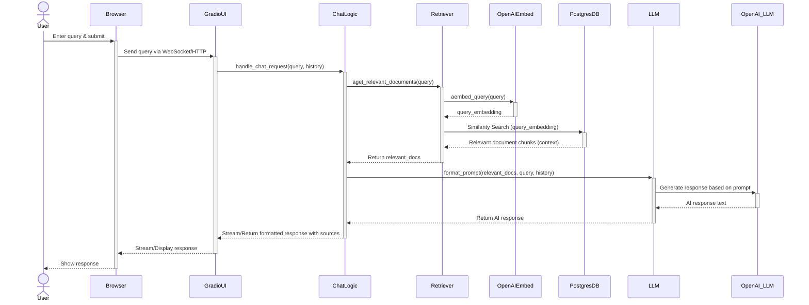

# Chat Interaction Flow

This sequence diagram shows the steps involved when a user submits a query through the Gradio chat interface.

**Explanation:**

1.  **User Input:** The user types a query into the Gradio interface in their browser.
2.  **Gradio Frontend:** The query is sent to the Gradio backend running in the `app` container.
3.  **Chat Logic:** The main chat handling function (within `chat_interface.py`) receives the query and conversation history.
4.  **Retrieval:** The `PostgresVectorRetriever` is invoked:
    *   It sends the query text to the **OpenAI Embedding API** to get a vector representation.
    *   It uses this vector to perform a similarity search against the **PostgreSQL/pgvector database**.
    *   The database returns the most relevant document chunks.
5.  **Context Formatting:** The Chat Logic receives the relevant document chunks (context).
6.  **LLM Interaction:**
    *   The Chat Logic formats a prompt containing the retrieved context, the original query, and the chat history.
    *   This prompt is sent to the **OpenAI Chat API**.
7.  **Response Generation:** OpenAI generates a response based on the provided information.
8.  **Output:** The generated response is streamed back through the Chat Logic and Gradio UI to the user's browser, often including citations based on the retrieved context. 