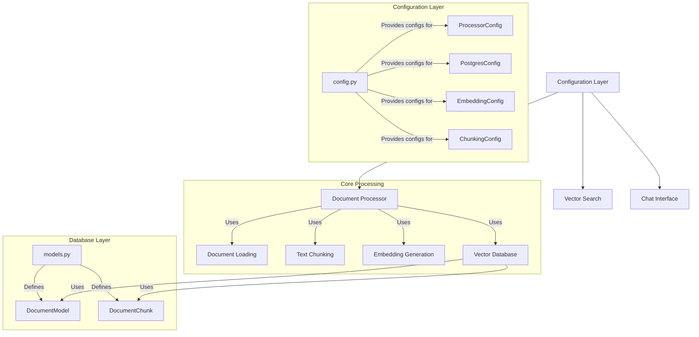

# AI Private Document Retriever - Architecture

This document visualizes the architecture and relationships between components in the AI Private Document Retriever project.

## System Architecture

## Component Descriptions

1. **Configuration Layer (`config.py`)**:
   - Central configuration hub that defines all system parameters
   - Provides configuration classes for different components (ProcessorConfig, PostgresConfig, etc.)
   - Manages environment variables and system resources

2. **Database Models (`models.py`)**:
   - Defines the database schema using SQLAlchemy
   - Two main models:
     - DocumentModel: Stores document metadata
     - DocumentChunk: Stores document chunks with embeddings

3. **Document Processing (`document_rag_loader.py`)**:
   - Main processing pipeline that:
     - Loads documents from various formats (PDF, TXT, DOCX, etc.)
     - Chunks text using RecursiveCharacterTextSplitter
     - Generates embeddings using OpenAI's embedding model
     - Stores documents and embeddings in PostgreSQL
   - Features:
     - Parallel processing with ThreadPoolExecutor and ProcessPoolExecutor
     - Rate limiting and resource monitoring
     - Error handling and retry mechanisms
     - Connection pooling for database operations

4. **Vector Search (`vector_similarity_search.py`)**:
   - Handles similarity searches in the vector database
   - Provides query embedding and retrieval capabilities

5. **Chat Interface (`chat_interface.py`)**:
   - User-facing interface for interacting with the system
   - Connects user queries to document retrieval and LLM processing
